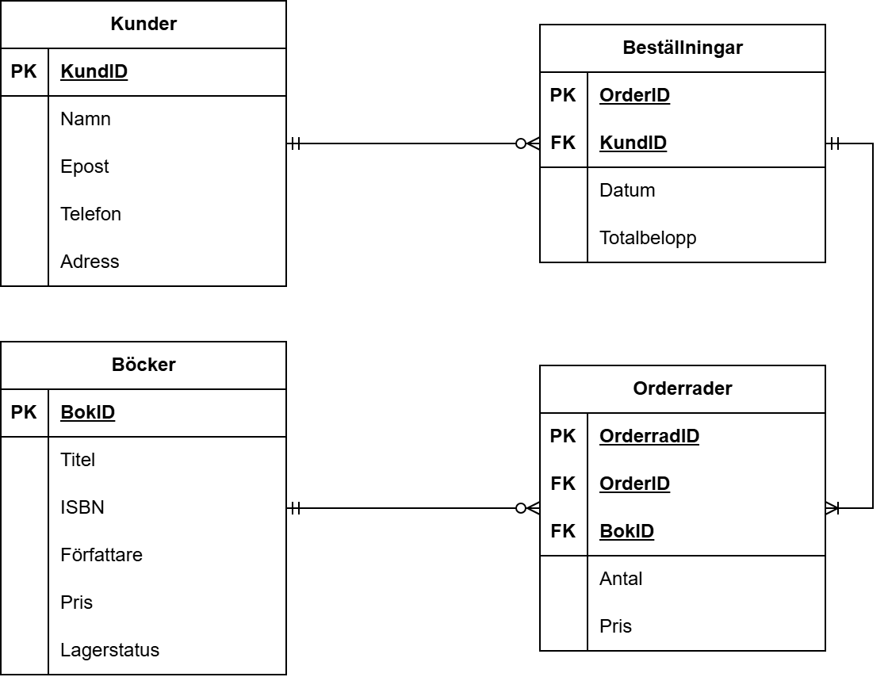

# :books: Bokstugan – Databas för liten bokhandel  
*Inlämning 1 – Databaser (YH25)*  
Gabriel Gustafsson

Detta projekt innehåller SQL-koden för att skapa en databas åt en liten bokhandel.  
Databasen består av fyra tabeller med relationer mellan kunder, böcker, beställningar och orderrader.

## ER-diagram

## Tabeller
- **Kunder** – information om kunder
- **Böcker** – boksortimentet (med ISBN, pris och lagerstatus)
- **Beställningar** – kundernas beställningar
- **Orderrader** – vilka böcker som ingår i varje beställning

## Funktioner som används
- Primärnycklar (PK) och AUTO_INCREMENT
- Främmande nycklar (FK) - för att skapa relationer
- UNIQUE och NOT NULL - regel att vara unikt och inte tomt
- CHECK - regler på pris och lagerstatus
- DEFAULT CURRENT_TIMESTAMP - för att automatiskt sätta datum
- INSERT - för att lägga in testdata
- SELECT - för att hämta data
- INNER JOIN - för att kombinera data från flera tabeller
- DESCRIBE - för att visa tabellstrukturer
- SHOW TABLES - för att lista alla tabeller

SQL-koden finns i [**inlamning1.sql**](inlamning1.sql).

